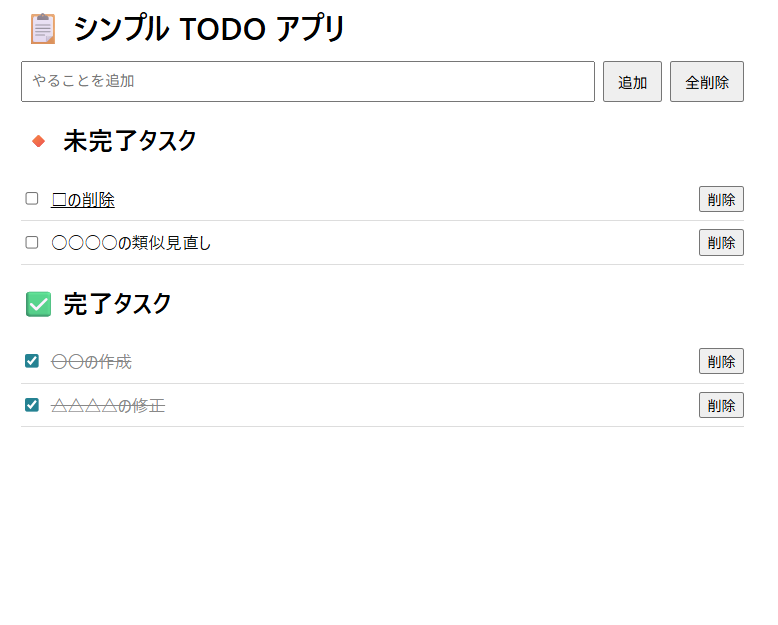
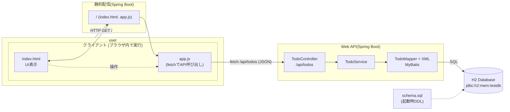

# todolist-webapi-js

TODO管理アプリケーション

- フロントは、javascriptによる画面制御
- バックエンドは、Spring-bootによる、JSON形式のWEBAPI



## システム概要図




## 実行 spring-boot:run

起動する
```
コマンドプロンプトで実行
mvnw.cmd spring-boot:run
```

## ブラウザアクセス
http://localhost:8080/  

